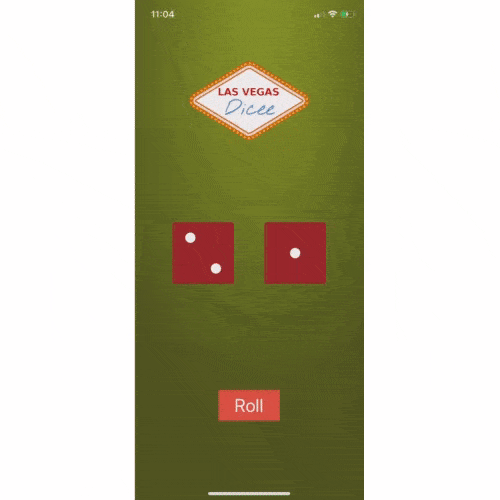

# myDicee App
This app was created as a part of a [Udemy course](https://www.udemy.com/share/101WsWAEMScldUQn8F/) I am taking (April 2020). The goal was to create an app which rolled a pair of dice, then to use Auto Layout to scale to different devices and orientations. 

I modified the final solution slightly in order to incorporate an "animated" dice roll to better simulate what a user would experience when rolling actual dice.

## Lesson Objectives

* How to add constraints and understanding how Auto Layout works.
* How to Pin and Align elements.
* How to create containers to configure advanced layouts.
* How to debug auto layout errors.
* Understanding what Xcode needs in order to correctly layout a design.
* How to use Stack Views to create complex interfaces.

>This is a companion project to The App Brewery's Complete App Development Bootcamp, check out the full course at [www.appbrewery.co](https://www.appbrewery.co/)

## Final Result

